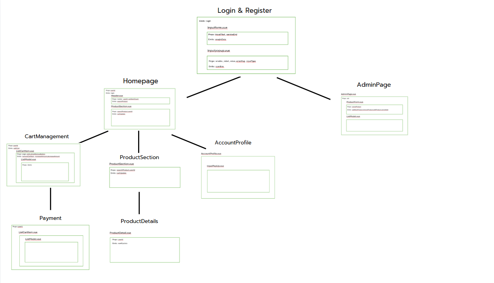

<h1>
  ขอบเขตของ Project
</h1>

  WebSite สำหรับขายสินค้าอิเล็กทรอนิกส์ โดยผู้ใช้สามารถเลือกซื้อสินค้าได้ตามใจชอบตามความต้องการของตนเอง โดยมีFeatureตามรายละเอียดดังนี้

<ul>
  <li>
    การสร้างบัญชีผู้ใช้และลงทะเบียนใช้งานของ User
  </li>
  <li>
    ระบบตะกร้าสินค้า
  </li>
  <li>
    ระบบการจัดการสินค้าสำหรับ Admin
  </li>
  <li>
    การแสดงข้อมูลสินค้า
  </li>
  <li>
    การค้นหาสินค้า
  </li>
</ul>
 <h1>
  การแบ่งงาน
</h1>
<table>
  <tr>
    <td> สมาชิก </td>
    <td> สิ่งที่รับผิดชอบ</td>
  </tr>
  <tr>
    <td>66130500105 Varis Nithiparkorn (30%)</td>
    <td> - Create User Account 
    - Login if user already have an account 
    - User can edit own information like address, name, phone and email</td>
  </tr>
  <tr>
    <td>66130500109  Kritsada Atchariyapruk (40%)</td>
    <td>
    - Header(search bar,จำนวนของในตะกร้า) 
    - หน้าตะกร้าสินค้า(ลบเพิ่มจำนวนสินค้าในตะกร้า) 
    - หน้าadmin (crud)</td>
  </tr>
  <tr>
    <td>66130500124  Phusara Khadseela (30%)</td>
    <td> - การแสดงข้อมูลสินค้า   
    - List สินค้าในหน้า Home  
    - Filler สินค้า  
</td>
  </tr>
</table>
<h1>
  ความคืบหน้า
</h1>
<table>
  <tr>
    <td> สมาชิก </td>
    <td> Week2</td>
    <td> Week3</td>
    <td> Week4</td>
    <td> Week5</td>
  </tr>
  <tr>
    <td>66130500105 Varis Nithiparkorn </td>
    <td> - Ui design in Loginform  - event click and input handler in inputField    </td>
    <td> - update responsive login ui  -Ui design sign up form  -add UserRegister and sign up component</td>
    <td> - CreateOrAuthAccount component use to create and auth input of user  -logic to validate input from user </td>
    <td> - Add profile page  - add feature edit account info in profile page  - add router path in login page and profile page</td>
  </tr>
  <tr>
    <td>66130500109  Kritsada Atchariyapruk</td>
    <td>- Header component </td>
    <td>- 3 Cart components for cart page   - Update header search bar search by product name from db </td>
    <td>- Admin page (listing product,remove product) - Payment page  - Update 3 cart components - Add Home page - Add router to home,cart,payment page </td>
    <td>- Admin page(add,edit) - update search bar - add cart&product state - update cart component</td>
  </tr>
  <tr>
    <td>66130500124  Phusara Khadseela</td>
    <td>- List Product Function </td>
    <td>- Filter UI   - Simple Check Filter Function </td>
    <td>- Product Detail UI   - Filter Function   - Add to cart Function </td>
    <td>- Update function add to cart  
-Add rounter to ProductDetail   - Update productSection.vue to use store form cart   - Add mapping image file for productdetail
 </td>
  </tr>
</table>

<h1>คู่มือการใช้งาน</h1>

1. ก่อนเริ่มต้นการใช้งาน ผู้ใช้จำเป็นต้องมี account ของตนเองก่อนเริ่มใช้งาน
 หากมีอยู่แล้วสามารถ กรอก username หรือ email บนแถบ username และใส่ password ให้ถูกต้อง

 1.2 หากผู้ใช้ยังไม่มี account เป็นของ ตนเอง สามารถ sign up และ กรอกข้อมูลส่วนตัวเพื่อสร้างบัญชีผ้ใช้ของตัวเองได้ ตามรูปดังนี้

 
 

2. เมื่อผู้ใช้ login สำเร็จจะพบหน้า hompage ที่แสดงสินค้าทั้งหมดบน website และผู้ใช้สามารถหาสินต้าที่จต้องการจากชื่อ หรือ ประเภทสินค้าได้ตามรูป

2.2 หากผู้ใช้ต้องการดูรายละเอียดสินค้าเพิ่มเติม สามารถ คลิกที่สินค้านั้นๆ และจะเข้าไปยังหน้า รายละเอียดสินค้า และบอกรายละเอียดทั้งหมดเกี่ยวกับสินค้าชิ้นนั้น และหากต้องการซื้อสินค้าชิ้นนั้นสามารถ คลิก เพิ่มลงตะกร้า เพื่อไปยังหน้าชำระเงินได้

3. หลังจากผู้ใช้เพิ่มสินค้าลงตะกร้าแล้ว สามารถตรวจสอบสินค้า อย่างจำนวนชิ้น ราคา ราคารวมของสินค้าทุกชิ้น ได้ 

3.2 หากต้องการแก้ไขจำนวนสินค้า สามารภเพิ่มลดได้ หรือ คลิกปุ่ม edit เพื่อทำการแก้ใขได้ ดังรูป

 

4. หากผู้ใช้ยืนยันสินค้าและกดชำระเงิน จะเข้าสูหน้าการชำระเงิน ผู้ใช้จำเป็นต้อง เพิ่มที่อยู่สำหรับรับสินค้าให้เรียบร้อย และคลิกชำระเงินเพื่อจบคำสั่งซื้อ

<h1>
  คลิปสาธิต features
</h1>
https://www.youtube.com/watch?v=KF11AWcn0_g
<h1>
  Components diagram
</h1>
 
<h2>
  AccountProfile page
</h2>
 
<h2>
  Admin page
</h2>
 
<h2>
  Cart page
</h2>
 
<h2>
  Home page
</h2>
 
<h2>
  Register page
</h2>
 
<h2>
  Payment page
</h2>
 

<h1>อ้างอิง</h1>

ข้อมูล,รูปภาพสินค้า - ihavecpu (https://ihavecpu.com/)

